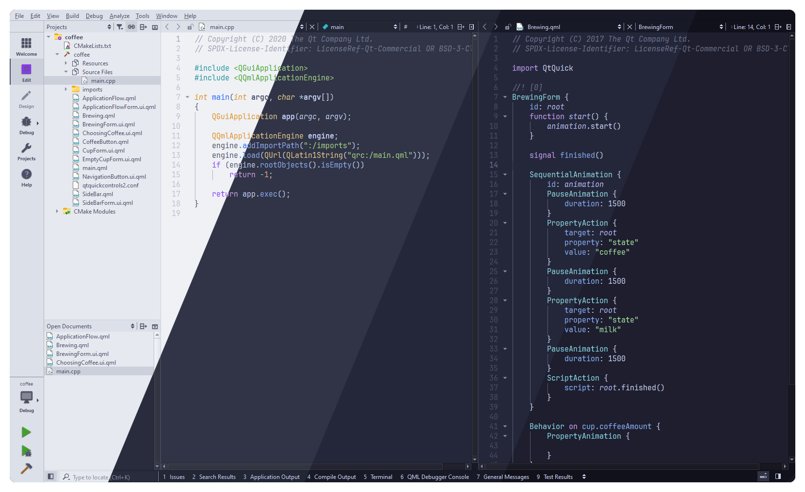
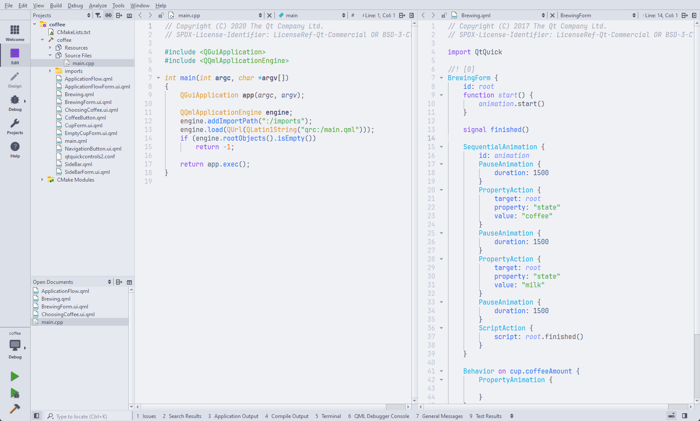
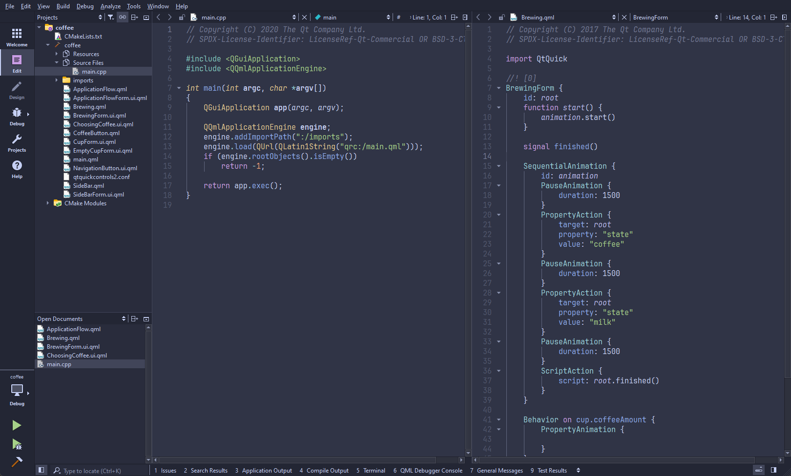
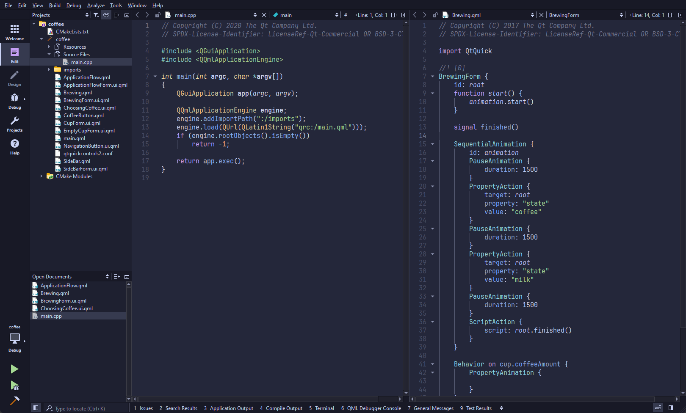
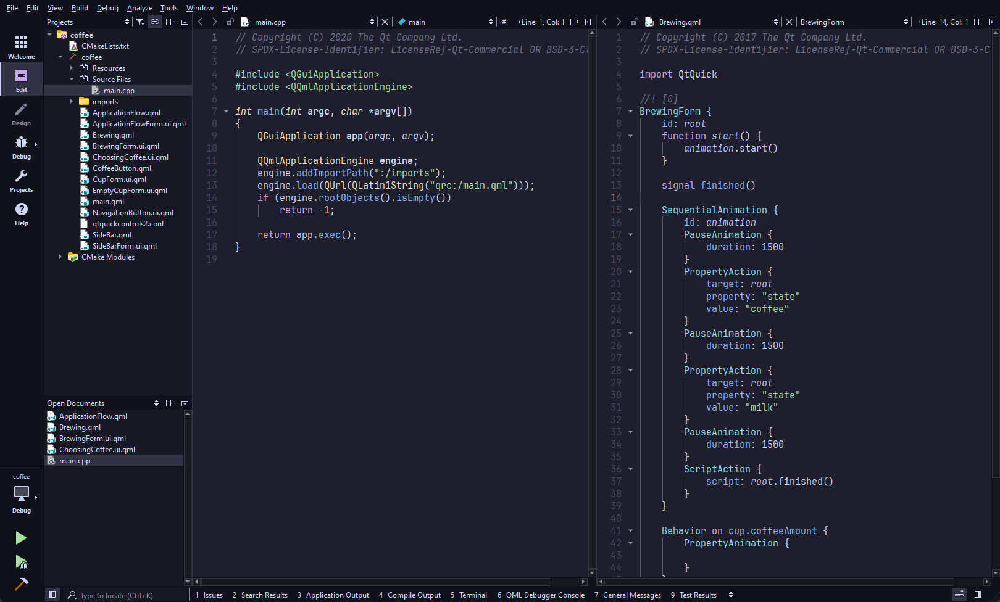

<h3 align="center">
	 
	
	Catppuccin for <a href="https://www.qt.io/product/development-tools">Qt Creator</a>
	
</h3>

	
	
	

	

## Previews

🌻 Latte

🪴 Frappé

🌺 Macchiato

🌿 Mocha

## About

Based on [Dracula](https://github.com/dracula/qtcreator/) and
[One Dark](https://gitlab.com/iohanaan/qtcreator-onedark/-/tree/master).

## Usage

1. Make the following directories if they don't already exist:
    - Linux & macOS
        - `~/.config/QtProject/qtcreator/styles`
        - `~/.config/QtProject/qtcreator/themes`
    - Windows
        - `<Qt install dir>\Tools\QtCreator\share\qtcreator\styles`
        - `<Qt install dir>\Tools\QtCreator\share\qtcreator\themes`
2. Copy your preferred flavour from [`styles/`](styles/) into the
`qtcreator/styles` directory.
3. Place your preferred flavour from [`themes/`](themes/) into the
`qtcreator/themes` directory.
4. Set the theme & color scheme in Qt Creator:
    1. Go to Edit > Preferences.
    2. Select the "Environment" tab. Change the Theme dropdown to your
    flavour of choice.
    3. Press OK. Qt Creator will prompt you to restart, press Restart Now.
    4. *Usually* Qt Creator will automatically select the matching text editor theme for you. If not continue to #6.
    5. Go to Edit > Preferences again.
    6. Select the "Text Editor" tab. Change the Color Scheme dropdown to your
    flavour of choice.

## 💝 Thanks to

- [backwardspy](https://github.com/backwardspy)

&nbsp;

	

	Copyright &copy; 2021-present <a href="https://github.com/catppuccin" target="_blank">Catppuccin Org</a>

	

